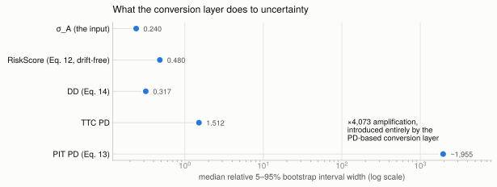

# Market-Based Credit-Rating Pipeline

[](https://github.com/JackyJiang08/market-based-credit-rating/actions/workflows/ci.yml)
[](https://github.com/JackyJiang08/market-based-credit-rating/actions/workflows/devlog.yml)
[](https://www.python.org/)
[](LICENSE)

A market-based credit-rating pipeline for public companies. It downloads equity
and rate data, estimates a **KMV/Merton** structural model by **EM** (recovering
asset value, asset volatility, and asset return), and produces **Time-Consistent
(TiC)** credit measures — RiskScore, Distance-to-Default, a Point-in-Time PD, a
no-regulatory-arbitrage Through-The-Cycle PD, and an **S&P-equivalent** letter
rating.

The methodology reference materials and the `TiC_TTC_conversion.xlsx` workbook
are licensed material, kept out of the repository (a git-ignored `local/` tree);
code docstrings cite the methodology by equation number.

## Results at a glance

- **×4,073** — how much the PD-based conversion layer amplifies parameter uncertainty vs the drift-free RiskScore, measured on ten real companies → [parameter uncertainty](#parameter-uncertainty-the-bootstrap)
- **τ = 0.956** — median Kendall's τ of the risk ordering across 2,000 bootstrap replicates; the extremes are essentially never misordered → [rank stability](#parameter-uncertainty-the-bootstrap)
- **7 notches** — how far one company's letter (T) moves on the unargued long-term-debt weight alone → [convention uncertainty](#convention-uncertainty-the-debt-weight-sweep)
- **7/10 rated, 3/10 scale-resolved** — coverage stated honestly: most letters are pinned by the scale, not resolved by the model → [what the scale could resolve](#what-the-scale-could-resolve)
- **150-name universe, 0 unexplained failures** — every non-rating classified (gates, defective drift, data), two real bugs found and fixed by scale alone → [docs/UNIVERSE.md](docs/UNIVERSE.md)
- **ρ = 0.79 against actual agency ratings** (0.73 restricted to scale-resolved names) — the ordering validates; the letter runs +5 notches optimistic and DD alone ties RiskScore → [validation study](docs/analysis/VALIDATION.md)



## Pipeline at a glance

```text
packages/core/creditrating/
  data/         providers (Yahoo/FRED), cleaning, alignment, sectors,
                cache, provenance + manifest, the batch pipeline
  model/        em.py (E=g(A) inversion), tic.py (Eq. 11-14 measures),
                conversion.py (PIT->TTC->S&P), drift regime + config
  tables/       conversion-grid loader + structural validation
                (the grids themselves are licensed, git-ignored local/)
  io/           records (one schema), workbook writer, excel, csv export
  diagnostics/  bootstrap uncertainty, domain-invariant checks
  cli.py        typer CLI (`mdt` / `creditrating`)
services/api/   phase 11 (placeholder)   apps/terminal/  phase 12 (placeholder)
```

One package, four responsibilities, pandas frames flowing forward. See
[`docs/DEPENDENCY_MAPS.md`](docs/DEPENDENCY_MAPS.md) and
[`docs/GAP_ANALYSIS.md`](docs/GAP_ANALYSIS.md).

## Method (formula → code → reference)

| Step | Where | Reference |
| --- | --- | --- |
| Equity `E = shares x price` (dividends added back) | `creditrating/data/alignment.py` | total-return convention: a dividend is firm value paid out, not destroyed |
| Default-point debt `D = 100% ST + 50% LT` | `creditrating/data/cleaning.py` | the standard KMV default-point convention |
| As-of alignment of price / statement / 1Y rate (no look-ahead) | `creditrating/data/alignment.py` | point-in-time discipline ([TIMING_PROTOCOL](docs/TIMING_PROTOCOL.md)) |
| **EM**: invert `E = g(A)` by bisection; recover `sigma_A`, `A`, `eta_A` | `creditrating/model/em.py` | Eq. (10) |
| `mu`, `CCM` (first-passage factors) | `creditrating/model/tic.py` | Eq. (11) |
| `TiC = sigma_A^2/ln^2(A/D)`, `RiskScore = 100*TiC` | `model/tic.py` | Eq. (12), (5) |
| `DD`, `EDF = Phi(-DD)` | `model/tic.py` | Eq. (14) |
| `PIT PD` (inverse-Gaussian first-hitting) | `model/tic.py` | Eq. (13) |
| No-arbitrage `alpha` match, `CCM*`; TTC PD; S&P letter | `creditrating/model/conversion.py` | Prop. 5.2, Sec. 5.3 |
| `Outlook = PIT PD - TTC PD` | `model/conversion.py` | Prop. 5.3 |

Verified against the methodology's published anchors: PIT PD reproduces
Tables 13–14; `alpha_FH(1.5)=0.91906`, `CCM*=1.35373`.

## Data sources

| Data | Source |
| --- | --- |
| Prices, shares, dividends, balance sheets | Yahoo Finance (`yfinance`) |
| Risk-free rate: **1-Year Treasury** (`DGS1`) | FRED (Federal Reserve H.15) |

The 1-year tenor matches the 1-year credit horizon used throughout the model.

## Quickstart

```bash
pip install -r requirements.txt -r requirements-dev.txt   # Python 3.11+

# One company (ticker or name) -> prints the rating table + writes a report
python -m mdt rate AAPL

# The batch run -> outputs/submission_<timestamp>.xlsx
python -m mdt batch config/companies.yaml

# The 150-name universe (parallel, resumable via data/cache/) -- docs/UNIVERSE.md
python -m mdt batch config/universe.yaml --workers 6

# Backward-compatible workflow entry
python run.py COST KO --years 2
```

What `rate` prints (abbreviated — a real run, 2026-07-26):

```text
======================================================
  Costco Wholesale Corporation (COST)
======================================================
  INPUTS
    Last price               : 935.03
    Default-point debt D     : 4,068,000,000
    Risk-free r (DGS1)       : 4.150%
  MODEL (EM)
    Asset value A            : 418,568,631,432
    Asset volatility sigma_A : 19.52%
    Asset return eta_A       : 14.33%   (t = 1.37)
  CREDIT MEASURES
    RiskScore (Eq. 5/12)     : 0.18
    Distance to Default      : 24.37
    PIT PD                   : 0.0000%
    TTC PD                   : 0.0100%
  RATING
    S&P letter (interval)    : AAA (AAA..AAA-)
    Determination            : PINNED_AT_SCALE_TOP
    Basis                    : ANALYTICAL
  FLAGS
    ! WEAKLY_IDENTIFIED (|t| = 1.37 < 2): read the interval, not the point rating
    ! TTC PD at the grid's 2bp floor -> letter is floor-determined
======================================================
```

Committed cache fixtures make the demo run **offline**: `python -m mdt rate COST`
works on a fresh clone with no network (data/cache/, see docs/UNIVERSE.md).

To enable the TTC/S&P conversion, place the
`TiC_TTC_conversion.xlsx` workbook at `local/TiC_TTC_conversion.xlsx` (git-ignored).
Without it the pipeline still runs and reports σ_A / DD / PIT PD; the TTC/S&P
columns are simply skipped.

Outputs (all git-ignored, regenerated by running):
- `outputs/submission_<timestamp>.xlsx` — the submission `Asset` sheet + a `validation` sheet.
- `dashboard/output/` — per-company workbooks, master summary, tidy long table.
- `raw_data_architecture/data/` & `data_cleaning/data/` — per-company raw + cleaned CSV/XLSX.

## Tests

```bash
pip install -r requirements.txt -r requirements-dev.txt
pytest
```

Those two commands are the entire fresh-clone story (a dependency-declaration
canary test keeps them true; CI installs from the same two files and nothing
else). `make setup && make demo` wraps them and runs the offline demo.

`make` targets: `setup | test | lint | run | batch | demo` (`lint` runs ruff,
black and mypy — all clean). The offline suite
covers the no-look-ahead canary, EM recovery of a known σ_A, measures vs the
reference tables, and conversion checks. Grid/lookup tests that need the
proprietary workbook skip automatically when `local/` is absent, so a fresh
clone is green. CI runs the same suite with coverage on every push.

## Findings in depth: what survives uncertainty, and what does not

**The drift-free rating and the rank ordering survive uncertainty. The PD-based letter
does not.** A published letter carries **three distinct sources of uncertainty** —
**parameter** (sampling noise, measured by the bootstrap), **convention** (the unargued
0.5 debt weight, measured by the sweep), and **specification** (whether the barrier is
right at all, exposed by PNC) — and they are of comparable size. Each is presented below;
the combined conclusion follows them.

### Parameter uncertainty: the bootstrap

A moving-block bootstrap over the EM-recovered asset returns (2,000
replicates, `signal_construction/bootstrap.py`) separates the drift-free quantities from
the PD chain cleanly:

| Quantity | Median relative interval width | Amplification |
|---|---:|---|
| σ_A | 0.240 | — |
| **RiskScore** (Eq. 12, drift-free) | **0.480** | **×2.00 vs σ_A** |
| DD (Eq. 14) | 0.317 | ×1.3 |
| TTC PD | 1.512 | ×3.2 vs RiskScore |
| **PIT PD** (Eq. 13) | **~1,955** | **×4,073 vs RiskScore** |

×2.00 is not approximately the square — it *is* the square. Differentiating
`RiskScore ∝ σ_A²` gives `d(RS)/RS = 2·dσ/σ`, and the measured ratio is 2.00. RiskScore
inherits the volatility's uncertainty and **nothing else**; no instability enters before
the conversion. The amplification is introduced entirely by the PD-based conversion layer.

**Rank ordering is stable.** Kendall's τ between each replicate's ordering of the ten
companies and the point-estimate ordering: **median 0.956**, 5th percentile 0.867, and
99.9% of replicates score τ ≥ 0.8. The safest and riskiest names are essentially never
misordered — COST ranks 1st in 100% of replicates, ORCL 10th in 99.7%.


**Two honesty points, both load-bearing:**

1. **RiskScore at 48% relative width is *unamplified*, not tight.** A ±24% band on a risk
   score is material. The claim is that it is exactly what its inputs support and ~4,000×
   better than the PD route — not that it is precise.
2. **The ordering shuffles in the genuinely-close middle.** INTU, KHC and T occupy ranks
   5–9 and swap freely (INTU holds its exact point rank in only 35% of replicates). The
   stability is at the extremes, where the companies are actually far apart.

### Why the framework itself predicts this result

This is not a defect we discovered; it is the result the framework predicts. Prop. 4.4.2
establishes that `TiC = σ_A²/ln²(A₀/D)` is invariant under the Girsanov change of measure
**precisely because it does not depend on η** — the `(η − σ_A²/2)` terms cancel exactly
between Eq. (11) and Eq. (12). Every other quantity in the chain keeps that dependence:
`µ` and `CCM` divide by the drift (Eq. 11), and Eq. (13) then exponentiates it through the
inverse-Gaussian first-hitting formula. Section 2's critique of PD-based agency ratings is
the qualitative version of the same argument.

Our contribution is the measurement: a ×4,073 amplification between two quantities computed
from the same two parameters, on ten real companies.

### Convention uncertainty: the debt-weight sweep

The bootstrap holds `A₀` and `D` fixed because they are observations. **`D` is not an
observation.** It is `1.0·ST + 0.5·LT`, and the 0.5 is a convention nobody has justified
from data. Sweeping the long-term weight over {0, 0.25, 0.5, 0.75, 1.0} and the statement
vintage (`docs/reconciliation/convention_sweep.py`) puts that choice on the same notch
scale as the bootstrap interval:

| | w=0 | w=0.25 | **w=0.5** | w=0.75 | w=1.0 | prev vintage | Convention span | Bootstrap span |
|---|---|---|---|---|---|---|---:|---:|
| COST | AAA | AAA | **AAA** | AAA | AAA | AAA | 1 | 2 |
| KO | AAA | AAA | **AAA** | AAA | AAA | AAA | 1 | 2 |
| DELL | A | A- | **A-** | BBB+ | BBB+ | BBB | 4 | **10** |
| **ORCL** | NOT_RATED | BBB- | **BB** | BB- | B+ | NOT_RATED | **5** | 4 |
| **PNC** | *D=0* | AAA | **AAA-** | AA | AA- | AAA | **5** | 3 |
| WMT | AAA | AAA | **AAA** | AAA | AAA | AAA | 1 | 2 |
| INTU | — | — | **—** | — | — | — | 0 | 5 |
| AMZN | *D=0* | AAA | **AAA-** | AAA- | AAA- | AAA- | 2 | 2 |
| **T** | AAA- | AA+ | **A+** | A | A- | A+ | **7** | 6 |
| KHC | — | — | **—** | — | — | — | 0 | 4 |

**For ORCL, PNC and T, the convention span equals or exceeds the bootstrap span.** T moves
seven notches (AAA− to A−) on the debt weight alone. ORCL moves from unrateable to B+. The
published rating is at least as much a statement about the 0.5 as it is about the company.


Three further readings:

- **PNC and AMZN produce `D = 0` at w=0**, because their short-term debt is zero. For AMZN
  that is real; for PNC it is an artifact of a missing current-debt row (see
  [#16](https://github.com/JackyJiang08/market-based-credit-rating/issues/16)), so **PNC's
  entire default point is the long-term weight**.
- **INTU and KHC are unrated under every convention**, which is a robustness result: their
  defective drift is not an artifact of the debt rule.
- **The scale-pinned names do not move at all** (span 1). Another demonstration that a
  pinned letter is insensitive to its inputs — which is exactly why it carries no
  information.

The honest total uncertainty on a letter is therefore **wider than the bootstrap interval
alone**, and the bootstrap is correctly described as a lower bound.

### Specification uncertainty: PNC, where no convention lands on the truth

The sweep varies the weight *within* the barrier definition `ST + w·LT`. PNC shows the
definition itself can be wrong:

| Barrier definition | D | % of liabilities | Model letter |
|---|---:|---:|---|
| `standard` (`ST + 0.5·LT`) | $33.3bn | 6.2% | **AAA** |
| `total_liabilities` | $539.4bn | 100% | **BB** |
| Actual agency rating | — | — | **A / A2** |

**The conventions bracket the truth without landing on it.** Under the shipped rule the
model was looking at 6% of what PNC owes and returning AAA; treating everything it owes as
the barrier swings ~10 notches past the truth to BB. This is not an interval to widen — no
value of `w` is right — which is why the answer is a gate (`MODEL_NOT_APPLICABLE`,
[ADR 0003](docs/adr/0003-financial-firms.md)), not a better number.

### The combined conclusion

**The letter is dominated by drift noise AND an arbitrary convention — either alone moves
it several notches, and they act at once. RiskScore and the rank ordering are robust to
both**: RiskScore is drift-free (Prop. 4.4.2) and independent of the PD chain, and the
ordering holds Kendall's τ median 0.956 across bootstrap replicates and does not change
under any debt weight.

The scale-pinned names complete the argument: COST, KO and WMT do not move under **any**
weight (span 1) — not because they are precisely measured, but because a pinned letter is
insensitive to its inputs. **A letter that cannot move carries no information**; its
immunity to an arbitrary convention is the same fact seen from the other side.

### Validated against actual agency ratings

The full study — sourced ratings, stratified discrimination with bootstrap CIs,
calibration, baselines, sector stratification — is in
[docs/analysis/VALIDATION.md](docs/analysis/VALIDATION.md). The two headline facts:
the RiskScore ordering correlates ρ = 0.79 with the agency ordering (0.73 restricted
to the 36 scale-resolved names — it is not carried by pinned letters, and it holds
within every sector), while the letter conversion runs a median **+5 notches
optimistic** with only 16% of names within two notches. And the honest baseline:
**DD alone ties RiskScore on discrimination** (0.78 vs 0.79) — the TiC construction's
advantages are stability properties, not ranking properties.


### How a rating must be presented

**A letter rating is a derived, wide-interval conversion. It is never the headline.**
Wherever one appears — this README, the workbook, the API, the UI — it carries its
bootstrap interval and its flags. Concretely, ORCL is never written as `BB`; it is written

> **BB** (BBB−..BB−, unrateable in ~44% of replicates, weakly identified: drift t = 0.08)

Lead with `RiskScore` and the rank ordering. Use the letter only where an external
counterparty requires one, and never without its interval.


## What the scale could resolve

Separately from precision, `Rating Determination` records whether the *scale* could tell a
value from its neighbours. As of the 2026-07-26 run, of ten companies:

| Determination | Count | |
|---|---:|---|
| `SCALE_RESOLVED` | **3** | DELL, ORCL, T — the value sits inside the range the route can express |
| `PINNED_AT_SCALE_TOP` | **3** | COST, KO, WMT — RiskScore below the best published grade |
| `PINNED_AT_FLOOR` | **1** | AMZN — TTC PD at the conversion grid's 2bp floor |
| `MODEL_NOT_APPLICABLE` | **1** | PNC — see [ADR 0003](docs/adr/0003-financial-firms.md) |
| `NOT_RATED` | **2** | INTU, KHC — defective drift regime (Prop. 4.4.1) |

DELL was briefly gated for negative book equity — a quantity this market-based model never
uses. That spec was revised the same day: the gate is now the market-based test
`A > ST + 1.0·LT` (DELL passes with A ≈ $301bn against ≈ $31bn), and the full record —
original spec, objection, resolution, and why that margin — is in
[ADR 0003, Revision 1](docs/adr/0003-financial-firms.md).

**PNC is the case that motivated the gate.** Its default point under the shipped rule is
$33.3bn against **$539.4bn of total liabilities** — the model was looking at 6% of what the
bank owes and returning `AAA`. Rating it on total liabilities instead gives `BB`. Its actual
agency rating is **A / A2**, so the convention choice brackets the truth without landing on
it, and no choice of barrier rescues the model for a deposit-funded firm.

`SCALE_RESOLVED` is a statement about the scale, **not** about estimation precision. DELL
is the case that proves it: strongest drift t-statistic in the universe (2.01) and the
*widest* letter interval (10 notches), because it sits where the S&P scale is finely
notched. The field was called `MODEL_DETERMINED` until 2026-07-26; that name implied a
precision claim it never made. Precision is answered by `Drift t` and the rating interval.

"7 of 10 rated" without "3 of 10 scale-resolved" overstates coverage, and neither number
says anything about precision. Full explanation:
[`docs/RATING_DETERMINATION.md`](docs/RATING_DETERMINATION.md); the uncertainty method and
its known limits: [`docs/UNCERTAINTY.md`](docs/UNCERTAINTY.md).

## Known limitations

- **Market-based PIT PD is liquidity-sensitive.** For large, liquid,
  investment-grade names PIT PD is legitimately ~0; compare firms by **DD** and
  **RiskScore** rather than PIT PD. Typical asset volatilities land in ~10-60%.
- **η_A is noisy** over a short estimation window — the classic drift-estimation
  problem; this shows up in µ/CCM/PIT but *not* in the η-independent RiskScore.
- **Off-grid conversions** (CCM or µ outside the lookup grid) are edge-clamped
  and flagged in the `validation` sheet.
- **Yahoo free tier** returns ~5-7 quarters of statements; banks (e.g. PNC)
  omit a clean current/non-current split (handled by a debt fallback).
- The `Asset` sheet `R` column is the realized drift `η_A - σ_A^2/2` (the DD
  term); pending confirmation of the intended definition.

## Methodology & acknowledgements

This pipeline is an **independent implementation of the Time-Consistent (TiC)
credit-rating methodology (Y. Yang)**, combined with standard KMV/Merton
structural-model machinery. The methodology is not ours: equation and
proposition numbers are retained in the docstrings of every module that
implements a TiC formula (`signal_construction/em.py`, `measures.py`,
`conversion.py`) — that is the attribution mechanism, and it stays. The
reference materials and the conversion workbook are licensed third-party
material and are not part of this repository; the implementation must not be
represented as original methodology.

## License

Project code: [Apache-2.0](LICENSE) (see also [NOTICE](NOTICE)). The
methodology reference materials and the conversion workbook are licensed
third-party material, **not** covered by the project license, and are kept out
of the repository.
