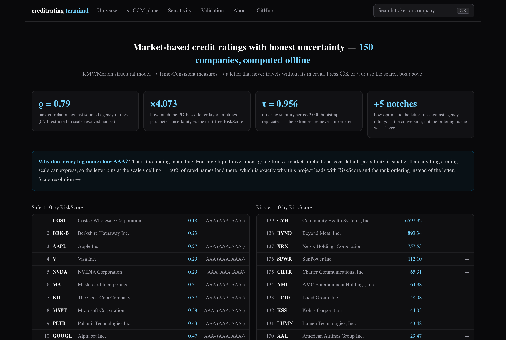
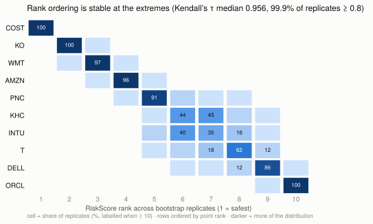
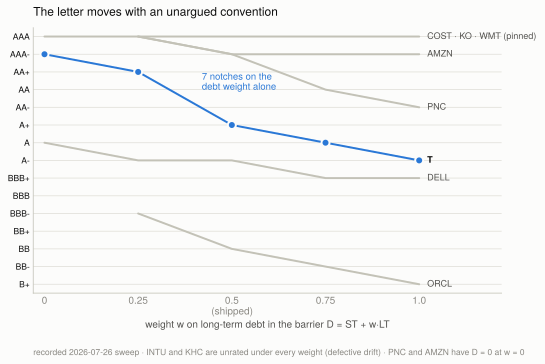
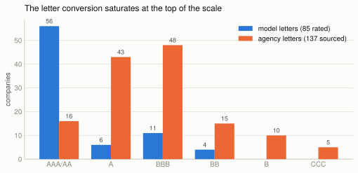
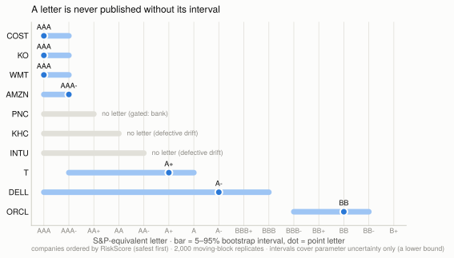
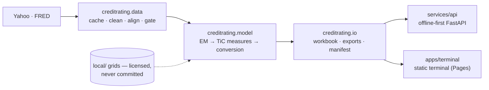

# Market-based Credit Ratings

[](https://github.com/JackyJiang08/market-based-credit-rating/actions/workflows/ci.yml)
[](https://github.com/JackyJiang08/market-based-credit-rating/actions/workflows/devlog.yml)
[](.github/workflows/ci.yml)
[](https://jackyjiang08.github.io/market-based-credit-rating/)
[](https://www.python.org/)
[](.github/workflows/ci.yml)
[](LICENSE)

A KMV/Merton structural model with Time-Consistent (TiC) credit measures that
rates 150 public companies and **publishes how much of each rating survives its
own uncertainty** — the drift-free RiskScore and the rank ordering do; the
letter does not, and every letter ships with the interval that proves it.

**Live demo: [jackyjiang08.github.io/market-based-credit-rating](https://jackyjiang08.github.io/market-based-credit-rating/)** — the
150-name universe, the µ–CCM plane, and a sensitivity playground, all computed
offline from committed data.

<!-- INLINE VIDEO — to make the demo autoplay inline on GitHub:
     1. open any issue/PR comment box on github.com and drag in
        docs/figures/terminal_demo.mp4 (H.264, 21 s, 1.4 MB)
     2. copy the generated github.com/user-attachments/assets/… URL
     3. replace the poster block below (image + ▶ line) with that bare URL on
        its own line, no markdown around it — GitHub renders an inline player.
     Until then the poster screenshot below is the visible element.
     The video is recorded by a committed script (apps/terminal/scripts/
     record_demo.mjs) and transcoded with ffmpeg. INLINE_VIDEO_URL -->

[](https://raw.githubusercontent.com/JackyJiang08/market-based-credit-rating/main/docs/figures/terminal_demo.mp4)

▶ [21-second demo video (MP4)](https://raw.githubusercontent.com/JackyJiang08/market-based-credit-rating/main/docs/figures/terminal_demo.mp4) — landing → ⌘K `ORCL` → interval-attached letter → µ–CCM plane.

## Results at a glance

| Number | The finding | Chart | Interactive |
|---|---|---|---|
| **×4,073** | how much the PD-based conversion layer amplifies parameter uncertainty vs the drift-free RiskScore → [parameter uncertainty](#parameter-uncertainty) | [amplification ladder](docs/figures/amplification_ladder.svg) | [sensitivity playground](https://jackyjiang08.github.io/market-based-credit-rating/sensitivity/) — drag the drift slider and watch RiskScore not move |
| **τ = 0.956** | median Kendall's τ of the risk ordering across 2,000 bootstrap replicates; the extremes are essentially never misordered → [parameter uncertainty](#parameter-uncertainty) | [rank-stability heatmap](docs/figures/rank_stability_heatmap.svg) | [µ–CCM plane with the ORCL cloud](https://jackyjiang08.github.io/market-based-credit-rating/plane/?focus=ORCL) |
| **ρ = 0.79** | RiskScore ordering vs sourced agency ratings (0.73 restricted to scale-resolved names; holds within every sector) → [agency validation](#agency-validation) | [rank scatter](docs/analysis/rank_scatter.svg) | [validation page](https://jackyjiang08.github.io/market-based-credit-rating/validation/) |
| **+5 notches** | median optimism of the letter conversion vs agency ratings — the conversion, not the ordering, is the weak layer → [agency validation](#agency-validation) | [notch errors](docs/analysis/notch_errors.svg) | [validation page](https://jackyjiang08.github.io/market-based-credit-rating/validation/) |

Secondary numbers, stated honestly: **7/10 rated but only 3/10
scale-resolved** on the original panel ([scale resolution](#scale-resolution));
**150-name universe with 0 unexplained failures** — every non-rating classified
([docs/UNIVERSE.md](docs/UNIVERSE.md)); and **DD alone ties RiskScore on
discrimination** (0.78 vs 0.79) — the TiC construction's advantages are
stability properties, not ranking properties
([validation study](docs/analysis/VALIDATION.md)).

These four numbers have one source of truth
([docs/analysis/data/headline.json](docs/analysis/data/headline.json)), and
[`tests/test_headline_numbers.py`](tests/test_headline_numbers.py) recomputes
them from the committed run-of-record data and fails CI if any surface drifts.

## Quickstart

**Just looking?** The [live site](https://jackyjiang08.github.io/market-based-credit-rating/)
is the whole result set, computed offline from committed data.

**Running it** (Python 3.11+; committed cache fixtures make the demo work on a
fresh clone with no network):

```bash
pip install -r requirements.txt -r requirements-dev.txt
python -m mdt rate COST          # offline: one company → rating table + report
```

More entry points:

```bash
python -m mdt batch config/companies.yaml        # 10-name batch → outputs/submission_<UTC>.xlsx
python -m mdt batch config/universe.yaml --workers 6   # the 150-name universe
make serve                        # offline-first FastAPI service on :8000 (make demo for the CLI demo)
pytest                            # the offline suite — green on a fresh clone, local/ absent
```

What `rate` prints (abbreviated — a real run, 2026-07-26):

```text
======================================================
  Costco Wholesale Corporation (COST)
======================================================
  MODEL (EM)
    Asset value A            : 418,568,631,432
    Asset volatility sigma_A : 19.52%
    Asset return eta_A       : 14.33%   (t = 1.37)
  CREDIT MEASURES
    RiskScore (Eq. 5/12)     : 0.18
    Distance to Default      : 24.37
    PIT PD                   : 0.0000%
  RATING
    S&P letter (interval)    : AAA (AAA..AAA-)
    Determination            : PINNED_AT_SCALE_TOP
  FLAGS
    ! WEAKLY_IDENTIFIED (|t| = 1.37 < 2): read the interval, not the point rating
    ! TTC PD at the grid's 2bp floor -> letter is floor-determined
======================================================
```

To enable the TTC/S&P conversion, place the licensed
`TiC_TTC_conversion.xlsx` workbook at `local/TiC_TTC_conversion.xlsx`
(git-ignored). Without it the pipeline still runs and reports σ_A / DD /
PIT PD, and the grid tests skip.

## Findings

**The drift-free rating and the rank ordering survive uncertainty. The PD-based letter
does not.** A published letter carries **three distinct sources of uncertainty** —
**parameter** (sampling noise, measured by the bootstrap), **convention** (the unargued
0.5 debt weight, measured by the sweep), and **specification** (whether the barrier is
right at all, exposed by PNC) — and they are of comparable size. Each is presented below;
the combined conclusion follows them.

### Parameter uncertainty

A moving-block bootstrap over the EM-recovered asset returns (2,000
replicates, `creditrating.diagnostics.uncertainty`) separates the drift-free quantities from
the PD chain cleanly:

| Quantity | Median relative interval width | Amplification |
|---|---:|---|
| σ_A | 0.240 | — |
| **RiskScore** (Eq. 12, drift-free) | **0.480** | **×2.00 vs σ_A** |
| DD (Eq. 14) | 0.317 | ×1.3 |
| TTC PD | 1.512 | ×3.2 vs RiskScore |
| **PIT PD** (Eq. 13) | **~1,955** | **×4,073 vs RiskScore** |

×2.00 is not approximately the square — it *is* the square. Differentiating
`RiskScore ∝ σ_A²` gives `d(RS)/RS = 2·dσ/σ`, and the measured ratio is 2.00. RiskScore
inherits the volatility's uncertainty and **nothing else**; no instability enters before
the conversion. The amplification is introduced entirely by the PD-based conversion layer.
The [sensitivity playground](https://jackyjiang08.github.io/market-based-credit-rating/sensitivity/)
makes this tactile: the drift slider moves µ, CCM and PIT PD, and visibly does not move
RiskScore.

**Rank ordering is stable.** Kendall's τ between each replicate's ordering of the ten
companies and the point-estimate ordering: **median 0.956**, 5th percentile 0.867, and
99.9% of replicates score τ ≥ 0.8. The safest and riskiest names are essentially never
misordered — COST ranks 1st in 100% of replicates, ORCL 10th in 99.7%.



**Two honesty points, both load-bearing:**

1. **RiskScore at 48% relative width is *unamplified*, not tight.** A ±24% band on a risk
   score is material. The claim is that it is exactly what its inputs support and ~4,000×
   better than the PD route — not that it is precise.
2. **The ordering shuffles in the genuinely-close middle.** INTU, KHC and T occupy ranks
   5–9 and swap freely (INTU holds its exact point rank in only 35% of replicates). The
   stability is at the extremes, where the companies are actually far apart.

### Theoretical basis

This is not a defect we discovered; it is the result the framework predicts. Prop. 4.4.2
establishes that `TiC = σ_A²/ln²(A₀/D)` is invariant under the Girsanov change of measure
**precisely because it does not depend on η** — the `(η − σ_A²/2)` terms cancel exactly
between Eq. (11) and Eq. (12). Every other quantity in the chain keeps that dependence:
`µ` and `CCM` divide by the drift (Eq. 11), and Eq. (13) then exponentiates it through the
inverse-Gaussian first-hitting formula. Section 2's critique of PD-based agency ratings is
the qualitative version of the same argument.

Our contribution is the measurement: a ×4,073 amplification between two quantities computed
from the same two parameters, on ten real companies.

### Convention uncertainty

The bootstrap holds `A₀` and `D` fixed because they are observations. **`D` is not an
observation.** It is `1.0·ST + 0.5·LT`, and the 0.5 is a convention nobody has justified
from data. Sweeping the long-term weight over {0, 0.25, 0.5, 0.75, 1.0} and the statement
vintage (`docs/reconciliation/convention_sweep.py`) puts that choice on the same notch
scale as the bootstrap interval:

| | w=0 | w=0.25 | **w=0.5** | w=0.75 | w=1.0 | prev vintage | Convention span | Bootstrap span |
|---|---|---|---|---|---|---|---:|---:|
| COST | AAA | AAA | **AAA** | AAA | AAA | AAA | 1 | 2 |
| KO | AAA | AAA | **AAA** | AAA | AAA | AAA | 1 | 2 |
| DELL | A | A- | **A-** | BBB+ | BBB+ | BBB | 4 | **10** |
| **ORCL** | NOT_RATED | BBB- | **BB** | BB- | B+ | NOT_RATED | **5** | 4 |
| **PNC** | *D=0* | AAA | **AAA-** | AA | AA- | AAA | **5** | 3 |
| WMT | AAA | AAA | **AAA** | AAA | AAA | AAA | 1 | 2 |
| INTU | — | — | **—** | — | — | — | 0 | 5 |
| AMZN | *D=0* | AAA | **AAA-** | AAA- | AAA- | AAA- | 2 | 2 |
| **T** | AAA- | AA+ | **A+** | A | A- | A+ | **7** | 6 |
| KHC | — | — | **—** | — | — | — | 0 | 4 |

**For ORCL, PNC and T, the convention span equals or exceeds the bootstrap span.** T moves
seven notches (AAA− to A−) on the debt weight alone. ORCL moves from unrateable to B+. The
published rating is at least as much a statement about the 0.5 as it is about the company.
The playground's `w` slider is the
[interactive version](https://jackyjiang08.github.io/market-based-credit-rating/sensitivity/).



Three further readings:

- **PNC and AMZN produce `D = 0` at w=0**, because their short-term debt is zero. For AMZN
  that is real; for PNC it is an artifact of a missing current-debt row (see
  [#16](https://github.com/JackyJiang08/market-based-credit-rating/issues/16)), so **PNC's
  entire default point is the long-term weight**.
- **INTU and KHC are unrated under every convention**, which is a robustness result: their
  defective drift is not an artifact of the debt rule.
- **The scale-pinned names do not move at all** (span 1). Another demonstration that a
  pinned letter is insensitive to its inputs — which is exactly why it carries no
  information.

The honest total uncertainty on a letter is therefore **wider than the bootstrap interval
alone**, and the bootstrap is correctly described as a lower bound.

### Specification uncertainty

The sweep varies the weight *within* the barrier definition `ST + w·LT`. PNC shows the
definition itself can be wrong:

| Barrier definition | D | % of liabilities | Model letter |
|---|---:|---:|---|
| `standard` (`ST + 0.5·LT`) | $33.3bn | 6.2% | **AAA** |
| `total_liabilities` | $539.4bn | 100% | **BB** |
| Actual agency rating | — | — | **A / A2** |

**The conventions bracket the truth without landing on it.** Under the shipped rule the
model was looking at 6% of what PNC owes and returning AAA; treating everything it owes as
the barrier swings ~10 notches past the truth to BB. This is not an interval to widen — no
value of `w` is right — which is why the answer is a gate (`MODEL_NOT_APPLICABLE`,
[ADR 0003](docs/adr/0003-financial-firms.md)), not a better number.

### Combined conclusion

**The letter is dominated by drift noise AND an arbitrary convention — either alone moves
it several notches, and they act at once. RiskScore and the rank ordering are robust to
both**: RiskScore is drift-free (Prop. 4.4.2) and independent of the PD chain, and the
ordering holds Kendall's τ median 0.956 across bootstrap replicates and does not change
under any debt weight.

The scale-pinned names complete the argument: COST, KO and WMT do not move under **any**
weight (span 1) — not because they are precisely measured, but because a pinned letter is
insensitive to its inputs. **A letter that cannot move carries no information**; its
immunity to an arbitrary convention is the same fact seen from the other side.

### Agency validation

The full study — sourced ratings, stratified discrimination with bootstrap CIs,
calibration, baselines, sector stratification — is in
[docs/analysis/VALIDATION.md](docs/analysis/VALIDATION.md), with the tables and
charts also on the
[validation page](https://jackyjiang08.github.io/market-based-credit-rating/validation/).
The two headline facts: the RiskScore ordering correlates ρ = 0.79 with the
agency ordering (0.73 restricted to the 36 scale-resolved names — it is not
carried by pinned letters, and it holds within every sector), while the letter
conversion runs a median **+5 notches optimistic** with only 16% of names
within two notches. And the honest baseline: **DD alone ties RiskScore on
discrimination** (0.78 vs 0.79) — the TiC construction's advantages are
stability properties, not ranking properties.



### Presentation rule

**A letter rating is a derived, wide-interval conversion. It is never the headline.**
Wherever one appears — this README, the workbook, the API, the UI — it carries its
bootstrap interval and its flags. Concretely, ORCL is never written as `BB`; it is written

> **BB** (BBB−..BB−, unrateable in ~44% of replicates, weakly identified: drift t = 0.08)

Lead with `RiskScore` and the rank ordering. Use the letter only where an external
counterparty requires one, and never without its interval.



## Scale resolution

Separately from precision, `Rating Determination` records whether the *scale* could tell a
value from its neighbours. As of the 2026-07-26 run, of ten companies:

| Determination | Count | |
|---|---:|---|
| `SCALE_RESOLVED` | **3** | DELL, ORCL, T — the value sits inside the range the route can express |
| `PINNED_AT_SCALE_TOP` | **3** | COST, KO, WMT — RiskScore below the best published grade |
| `PINNED_AT_FLOOR` | **1** | AMZN — TTC PD at the conversion grid's 2bp floor |
| `MODEL_NOT_APPLICABLE` | **1** | PNC — see [ADR 0003](docs/adr/0003-financial-firms.md) |
| `NOT_RATED` | **2** | INTU, KHC — defective drift regime (Prop. 4.4.1) |

Across the 150-name universe the same split is 60% pinned at the scale top among rated
names — which is why the site's landing page answers "why is everything AAA?" before
showing a table.

`SCALE_RESOLVED` is a statement about the scale, **not** about estimation precision. DELL
is the case that proves it: strongest drift t-statistic in the universe (2.01) and the
*widest* letter interval (10 notches), because it sits where the S&P scale is finely
notched. The field was called `MODEL_DETERMINED` until 2026-07-26; that name implied a
precision claim it never made. Precision is answered by `Drift t` and the rating interval.

"7 of 10 rated" without "3 of 10 scale-resolved" overstates coverage, and neither number
says anything about precision. Full explanation:
[`docs/RATING_DETERMINATION.md`](docs/RATING_DETERMINATION.md); the uncertainty method and
its known limits: [`docs/UNCERTAINTY.md`](docs/UNCERTAINTY.md).

## Method

| Step | Where | Reference |
| --- | --- | --- |
| Equity `E = shares x price` (dividends added back) | `creditrating/data/alignment.py` | total-return convention: a dividend is firm value paid out, not destroyed |
| Default-point debt `D = 100% ST + 50% LT` | `creditrating/data/cleaning.py` | the standard KMV default-point convention |
| As-of alignment of price / statement / 1Y rate (no look-ahead) | `creditrating/data/alignment.py` | point-in-time discipline ([TIMING_PROTOCOL](docs/TIMING_PROTOCOL.md)) |
| **EM**: invert `E = g(A)` by bisection; recover `sigma_A`, `A`, `eta_A` | `creditrating/model/em.py` | Eq. (10) |
| `mu`, `CCM` (first-passage factors) | `creditrating/model/tic.py` | Eq. (11) |
| `TiC = sigma_A^2/ln^2(A/D)`, `RiskScore = 100*TiC` | `model/tic.py` | Eq. (12), (5) |
| `DD`, `EDF = Phi(-DD)` | `model/tic.py` | Eq. (14) |
| `PIT PD` (inverse-Gaussian first-hitting) | `model/tic.py` | Eq. (13) |
| No-arbitrage `alpha` match, `CCM*`; TTC PD; S&P letter | `creditrating/model/conversion.py` | Prop. 5.2, Sec. 5.3 |
| `Outlook = PIT PD - TTC PD` | `model/conversion.py` | Prop. 5.3 |

Verified against the methodology's published anchors: PIT PD reproduces
Tables 13–14; `alpha_FH(1.5)=0.91906`, `CCM*=1.35373`.

Data sources: prices, shares, dividends and balance sheets from Yahoo Finance
(`yfinance`); the risk-free rate is the **1-Year Treasury** (`DGS1`) from FRED,
matching the 1-year credit horizon used throughout the model.

## Conventions

The documented convention follows the framework's first-passage definitions;
the reference convention matches the team's reference implementation. Both
ship in `creditrating.model.convention`; the documented convention is the
default and the run of record everywhere (site, headline numbers, archived
deliverables), and every output row carries a `Convention` field.

| Switch | DOCUMENTED (run of record) | REFERENCE |
|---|---|---|
| µ denominator | η − σ²/2 (Ito drift) | raw η (no Ito adjustment) |
| negative drift | `NOT_RATED` (defective regime) | abs(η), flagged `MU_USES_ABS_DRIFT` |
| drift window | ~5y (volatility 252d separate) | 250 trading days, one shared span |
| barrier field | D = 1.0·ST + 0.5·LT | Total Liabilities (matched row recorded) |

Under the reference convention the applicability gates classify and annotate
rather than suppress — the financial-firm gate's rationale is `ST + 0.5·LT`
ignoring deposits, which changes under a total-liabilities barrier.

Equivalence on the deliverable names, given the reference implementation's
own inputs (formula lock: `tests/test_reference_convention.py`; "n.p." =
reference inputs not provided, recorded rather than guessed):

| Name | µ ours/ref | RiskScore ours/ref | abs-drift |
|---|---|---|---|
| AMZN | 16.9632 / 16.9632 | 2.1049 / 2.1038 | — |
| COST | 13.4993 / 13.4993 | 0.7379 / 0.7372 | — |
| INTU | 1.5477 / 1.5477 | 8.6867 / 8.6867 | flagged |
| ORCL | 2.7583 / 2.7583 | 21.3328 / 21.3296 | flagged |
| DELL, KHC, KO, PNC | n.p. | n.p. | — |

End-to-end at the same close, the extended reference convention brings
implied leverage within 0.2–1.0% of the reference on every reference-valued
name; the ablation shows the barrier is the dominant switch (the 250-day
window alone only flips drift signs and worsens the positive-drift names),
and what remains is (σ, η) estimation noise/scheme. The full per-switch
table: [reference reconciliation](docs/analysis/reference_reconciliation.md).

## Limitations

### Resolved along the way

Each row links the fix and the regression guard that keeps it fixed.

| Was wrong | Fixed by | Guarded by |
|---|---|---|
| Deposit-funded bank rated `AAA` | applicability gates ([`8623205`](https://github.com/JackyJiang08/market-based-credit-rating/commit/8623205), [ADR 0003](docs/adr/0003-financial-firms.md)) | `tests/test_sectors.py` |
| Book-equity gate blocked DELL | market-based test `A > ST + 1.0·LT` ([`ad15b95`](https://github.com/JackyJiang08/market-based-credit-rating/commit/ad15b95), [ADR 0003 Rev 1](docs/adr/0003-financial-firms.md)) | `tests/test_sectors.py` |
| Mixed reporting currencies (TM) | reporting-currency gate ([`1661304`](https://github.com/JackyJiang08/market-based-credit-rating/commit/1661304)) | `tests/test_currency_gate.py` |
| Payment networks gated as banks | industry-level classification ([`7635e18`](https://github.com/JackyJiang08/market-based-credit-rating/commit/7635e18)) | `tests/test_sectors.py::test_payment_networks_are_not_banks` |
| Unsigned drift, shared windows | signed drift + split estimation windows ([`bf46ff0`](https://github.com/JackyJiang08/market-based-credit-rating/commit/bf46ff0)) | `tests/test_window_invariance.py` |
| Uncertainty measurement had two bugs | the algebra-prediction test (RiskScore width must be exactly 2× σ_A's) surfaced them; fixed and the study re-run ([`c3e8a52`](https://github.com/JackyJiang08/market-based-credit-rating/commit/c3e8a52), [bug postmortem](docs/UNCERTAINTY.md)) | the two bootstrap regression tests in `tests/test_window_invariance.py`; `tests/test_headline_numbers.py` pins the re-run |
| pandas-3 datetime-unit merge failures | canonical `[ns]` at the cache boundary ([`44617f8`](https://github.com/JackyJiang08/market-based-credit-rating/commit/44617f8)) | `tests/test_cache.py::test_round_trip_is_dtype_identical`, CI pandas 2/3 matrix |
| NaN cascade from missing prices | drop-missing guards at every last-value read ([`6eb9826`](https://github.com/JackyJiang08/market-based-credit-rating/commit/6eb9826)) | `tests/test_transforms.py` NaN-propagation family |
| Delisted tickers unnamed on site | last-known-name map + "(delisted)" label ([`ac75cbc`](https://github.com/JackyJiang08/market-based-credit-rating/commit/ac75cbc)) | exporter map in `apps/terminal/scripts/build_site_data.py` |

### Still open

- **Market-based PIT PD is liquidity-sensitive.** For large, liquid,
  investment-grade names PIT PD is legitimately ~0; compare firms by **DD** and
  **RiskScore** rather than PIT PD. Typical asset volatilities land in ~10-60%.
- **η_A is noisy** over a short estimation window — the classic drift-estimation
  problem; this shows up in µ/CCM/PIT but *not* in the η-independent RiskScore.
- **The letter conversion runs +5 notches optimistic** against agency ratings —
  published as a finding, not corrected by refitting
  ([validation](docs/analysis/VALIDATION.md)).
- **Off-grid conversions** (CCM or µ outside the lookup grid) are edge-clamped
  and flagged in the `validation` sheet.
- **Yahoo free tier** returns ~5-7 quarters of statements; banks
  omit a clean current/non-current split (handled by a debt fallback).
- **Statement availability is approximated, not observed.** Statements enter
  the model at `period_end` plus a statutory filing lag (45 d for a 10-Q,
  90 d for a 10-K; `availability_method="estimated_lag"`) rather than their
  true filing timestamps; panels remain research prototypes, not
  backtest-safe datasets ([TIMING_PROTOCOL §9](docs/TIMING_PROTOCOL.md)).

## Architecture



One package owns the computation; the API and the web terminal are thin
consumers of its outputs. Full picture (package map, runtime data flow, the
static-site pipeline and the licensed-materials boundary, each with a
staleness guard in CI): [docs/ARCHITECTURE.md](docs/ARCHITECTURE.md).

**Decision records:** [ADR 0001 — drift estimation](docs/adr/0001-drift-estimation.md) ·
[ADR 0002 — defective-drift intervals](docs/adr/0002-defective-drift-interval-proposal.md) ·
[ADR 0003 — financial-firm applicability](docs/adr/0003-financial-firms.md).

**Static-site data pipeline:** `apps/terminal/scripts/build_site_data.py`
exports the run-of-record results to JSON; `check_bundle_safety.py` then
proves, against the licensed grids themselves (path, value and shape checks
over 8,993 values), that nothing licensed reaches the public bundle — the
check runs in the frontend CI cell and again inside the deploy job.

**The licensed-materials boundary:** the TiC reference materials and the
conversion workbook live in a git-ignored `local/` tree and are never
committed; `.gitignore` blocks the extensions, an acceptance check audits
`git ls-files`, and the pipeline degrades gracefully (σ_A / DD / PIT PD
without the letter) when `local/` is absent.

## Tests

```bash
pip install -r requirements.txt -r requirements-dev.txt
pytest
```

Those two commands are the entire fresh-clone story (a dependency-declaration
canary test keeps them true; CI installs from the same two files and nothing
else). `make setup && make demo` wraps them and runs the offline demo.

`make` targets: `setup | test | lint | run | batch | demo | serve` (`lint` runs
ruff, black and mypy — all clean). The offline suite covers the no-look-ahead
canary, EM recovery of a known σ_A, measures vs the reference tables, and
conversion checks. Grid/lookup tests that need the proprietary workbook skip
automatically when `local/` is absent, so a fresh clone is green. CI runs the
same suite with a ≥85% coverage gate on `model/`, `tables/` and
`diagnostics/`, on Python 3.11/3.12 × pandas 2/3.

## Methodology & acknowledgements

This pipeline is an **independent implementation of the Time-Consistent (TiC)
credit-rating methodology (Y. Yang)**, combined with standard KMV/Merton
structural-model machinery. The methodology is not ours: equation and
proposition numbers are retained in the docstrings of every module that
implements a TiC formula (`model/em.py`, `model/tic.py`,
`model/conversion.py`) — that is the attribution mechanism, and it stays. The
reference materials and the conversion workbook are licensed third-party
material and are not part of this repository; the implementation must not be
represented as original methodology.

## License

Project code: [Apache-2.0](LICENSE) (see also [NOTICE](NOTICE)). The
methodology reference materials and the conversion workbook are licensed
third-party material, **not** covered by the project license, and are kept out
of the repository.
