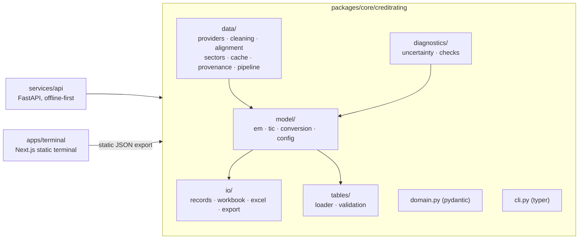
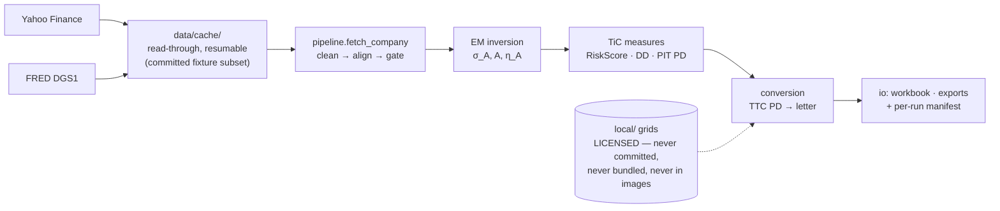
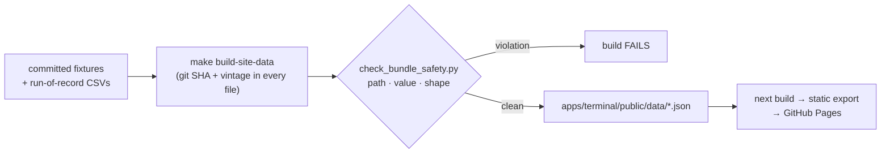

# Architecture

The current system, as built. Three diagrams, nothing speculative.
`tests/test_architecture_doc.py` fails CI if the package map below drifts
from the actual tree, so this document cannot silently go stale.

## Package map

One installable package owns everything computational; the API and the web
terminal are thin consumers. Import direction is one-way — nothing in
`creditrating` knows the API or the terminal exist.

## Runtime data flow

Every acquisition is cached and hashed into a per-run manifest, so a batch is
resumable, offline-runnable, and auditable. The licensed conversion grids sit
behind a hard boundary: absent on CI and in every artifact, with the
degraded path (`TTC = null` + reason code) tested as a first-class state.

## Static-site data pipeline

The terminal never computes: it renders the exported JSON, validated with
Zod at load time. The bundle-safety gate compares every exported numeric
against the licensed tables (zero matches allowed) before any site build.
