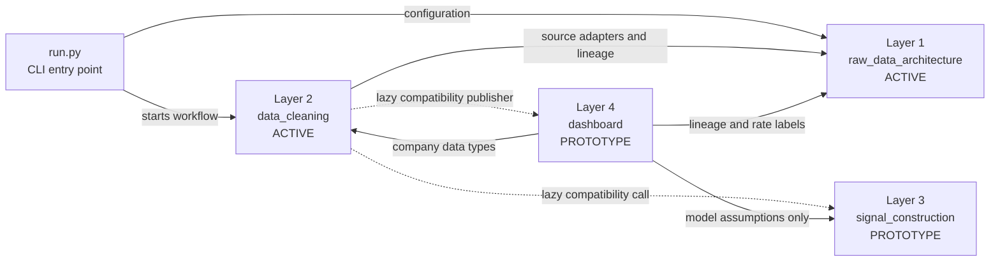
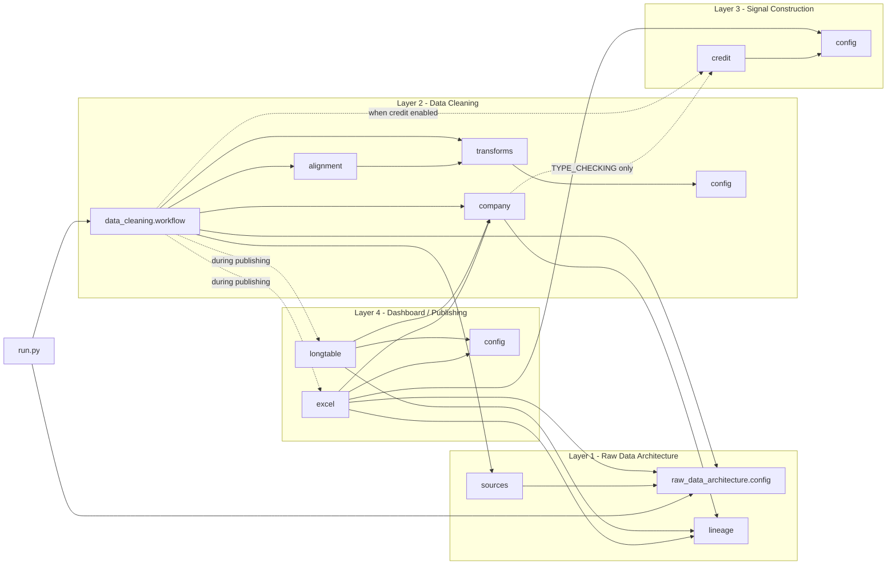
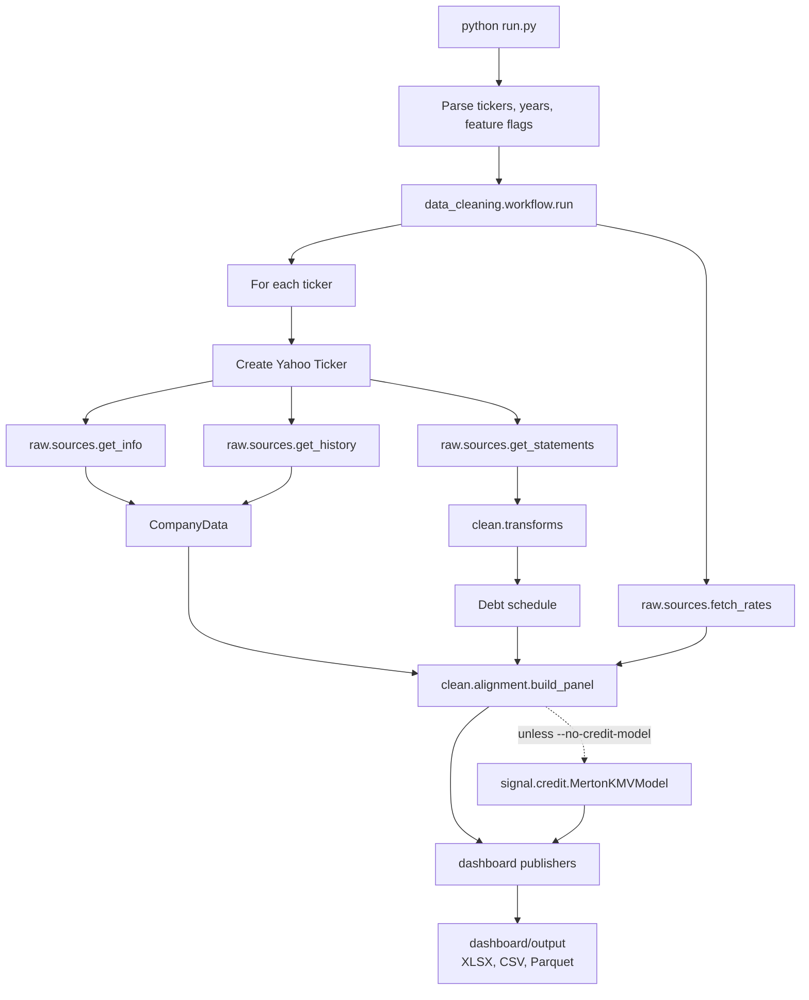
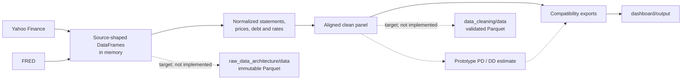

# Dependency Maps

These maps describe the current repository as implemented. Arrows in the code
maps point from a caller or consumer to the module it depends on. Dotted edges
identify optional, type-only, or transitional dependencies.

## 1. Layer dependency map

The intended long-term dependency direction is Layer 4 -> Layer 3 -> Layer 2 ->
Layer 1. The two dotted Layer 2 -> Layer 3/4 edges are temporary exceptions in
`data_cleaning/workflow.py`, retained so the old end-to-end CLI still works.

## 2. Python module dependency map

## 3. Runtime call map

## 4. Data artifact map

The solid path is implemented today. The dotted Parquet boundaries are the next
architecture milestone and are intentionally shown as missing dependencies.

## 5. External package map

| Layer | Direct packages | Purpose |
| --- | --- | --- |
| Raw Data Architecture | `yfinance`, `requests`, `pandas` | Yahoo/FRED acquisition and source frames |
| Data Cleaning | `pandas`, `numpy`; currently also `yfinance` in `workflow.py` | Transformation, alignment, compatibility orchestration |
| Signal Construction | `pandas`, `numpy`, `scipy` | Merton/KMV numerical model prototype |
| Dashboard | `pandas`, `openpyxl`, `pyarrow` | Excel, CSV, and Parquet publishing |

## Known dependency cleanup

1. Move `yf.Ticker(...)` creation out of `data_cleaning/workflow.py` and behind
   a Layer 1 adapter.
2. Replace the Layer 2 -> Layer 3/4 compatibility calls with a root-level stage
   orchestrator or separate CLI commands.
3. Remove the type-only `CompanyData -> CreditEstimate` reference by publishing
   signal records separately from clean company data.
4. Make Layer 4 consume versioned published tables rather than in-memory
   `CompanyData` objects.

Update these maps whenever a cross-layer import, stage entry point, or persisted
artifact contract changes.
