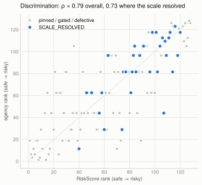
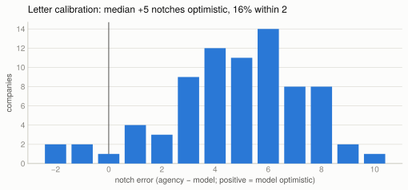
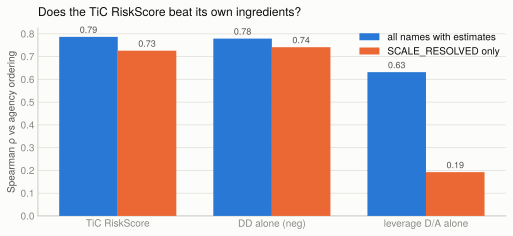

# Validation study: the model against actual agency ratings

The 150-name universe made a validation study meaningful; the 51-of-85 AAA
cluster made it necessary. This study compares the pipeline's outputs with
**sourced** agency ratings — discrimination first, calibration second,
baselines third — and reports where the model fails as prominently as where
it works.

Everything regenerates from committed inputs:
`python docs/analysis/validation_study.py` reads `agency_ratings.csv`, the
universe taxonomy, and `history/15`, writes `data/*.csv`, and renders the
four SVGs embedded below.

## Ground truth

`docs/analysis/agency_ratings.csv`: one row per name — S&P letter, Moody's
where known, **source and retrieval date (2026-07-26) per row**. 14 anchor
names spanning AAA to B− are press/agency-verified with citations (including
four live corrections to the earlier indicative seeds: ORCL was cut to BBB−
on 2026-07-09, NVDA raised to AA in June 2026, LUMN raised to B− in February
2026, CCL restored to investment grade); the remainder are labelled
`compiled ... unverified` and carried at the seed value. **13 names carry no
public rating and are excluded, not imputed** (GME, PLTR, recent IPOs, the
delisted names, and other unrated issuers). The comparison set is 137 names;
128 of them have model estimates.

## Discrimination — the stratification is the finding

Spearman ρ of RiskScore against the agency ordering, with a 5,000-draw
bootstrap CI, plus Kendall τ and Somers' D (the accuracy-ratio analogue for
an ordinal ground truth):

| Stratum | n | Spearman ρ | 90% CI | Kendall τ | Somers' D |
|---|---:|---:|---|---:|---:|
| All names with estimates | 128 | **0.787** | [0.713, 0.843] | 0.620 | 0.650 |
| Rated only | 77 | 0.819 | [0.725, 0.879] | 0.657 | 0.686 |
| **SCALE_RESOLVED only** | 36 | **0.726** | [0.531, 0.860] | 0.583 | 0.613 |

The correlation is **not** carried by the pinned names: restricted to the 36
names where the scale genuinely resolved a letter, ρ = 0.73 with a CI that
stays well clear of zero. Discrimination is a property of the risk measure,
not an artifact of the floor and ceiling.

### Within sectors — not riding the sector effect

σ_A by sector is monotonic, so a cross-sectional correlation could in
principle be a sector effect. It is not: the ordering holds **within** every
sector with n ≥ 8 (mean within-sector ρ = 0.837; Energy 0.95, Communication
Services 0.95, Consumer Defensive 0.94, Healthcare 0.83, Financial Services
0.81, Industrials 0.76, Technology 0.74, Consumer Cyclical 0.73; table in
`data/sector_correlations.csv`).

## Calibration — the letter conversion is the broken layer

Against the agency letter, on the 77 rated ∩ sourced names:

- **median error +5 notches optimistic**, IQR [+3, +6]
- within 1 notch: **9%** · within 2 notches: **16%**
- the broad-grade confusion matrix has 42 of 77 names in the model's AAA/AA
  row that the agencies place at A or BBB (`data/confusion_broad_grades.csv`)

This is the phase-5 uncertainty finding made external: the PD-based letter
conversion — the layer that amplifies parameter noise ×4,073 and swings on
the debt-weight convention — is also the layer that fails against the
agencies, saturating everything liquid and investment-grade into the top
notches. The rank ordering underneath it is fine.

## Baselines — the honest one

Same names, same agency ordering, ranked by single ingredients:

| Predictor | all estimates (n=128) | SCALE_RESOLVED (n=36) |
|---|---:|---:|
| TiC RiskScore (σ²/ln²(A/D)) | **0.787** | 0.726 |
| DD alone | 0.779 | **0.741** |
| Leverage D/A alone | 0.632 | 0.192 |

**RiskScore does not beat DD on this universe — they are statistically
indistinguishable** (ρ 0.79 vs 0.78 overall; DD is nominally *ahead* in the
resolved stratum). The marginal value of the TiC construction over plain
distance-to-default, measured on 128 names against agency ratings, is
approximately zero for rank ordering. What both handily beat is leverage
alone (0.63, collapsing to 0.19 within the resolved stratum) — the
volatility input, not the ratio construction, is where the discriminating
information lives. RiskScore retains two real advantages over DD that this
metric does not capture: it is drift-free (DD carries η's noise — its
bootstrap interval is ×1.3 wider than σ implies) and it is
Girsanov-invariant. But on discrimination alone, the claim "TiC beats KMV's
own DD" is **not supported** by this study, and we say so.

## Honest reading, including where the model fails

1. **Discrimination works** — ρ ≈ 0.79 overall, ≈ 0.73 where the scale
   resolved, and it holds within sectors. This is the defensible product.
2. **The letter fails calibration completely** — median +5 notches
   optimistic, 16% within two notches. Never present the letter as the
   product; the presentation rule (RiskScore first, letter with interval)
   exists for exactly this reason.
3. **The TiC ordering does not beat DD.** The marginal value of the
   conversion chain over its own DD ingredient is ~0 for ranking; its
   advantages (drift-independence, measure-invariance) are stability
   properties, not discrimination properties.
4. **Caveats:** 123 of 137 agency ratings are compiled-unverified (labelled
   per row); the universe oversamples hard cases; agency ratings are
   through-the-cycle judgments with inputs (covenants, support, sector
   methodology) this model never sees, so perfect agreement is not even the
   right target.
